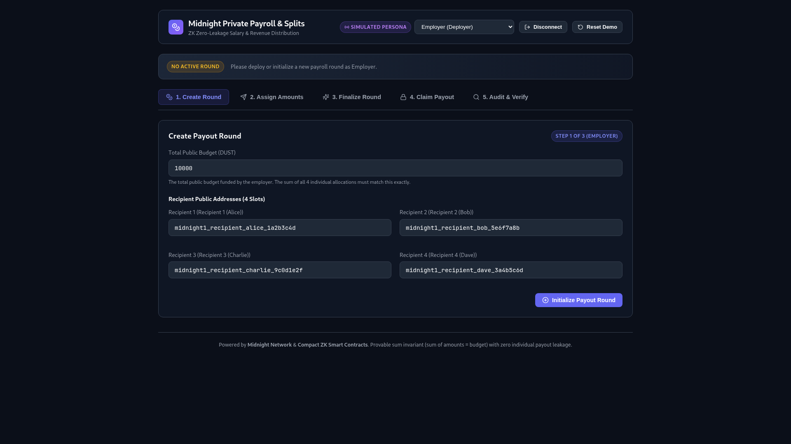
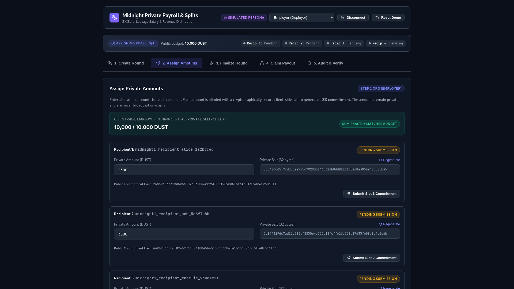
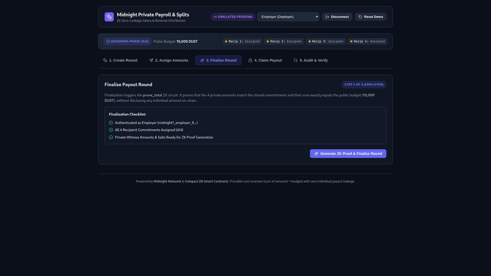
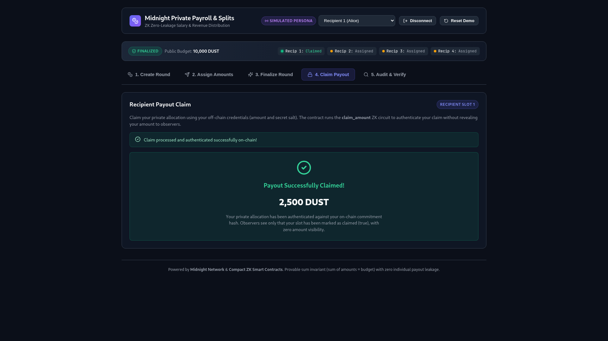
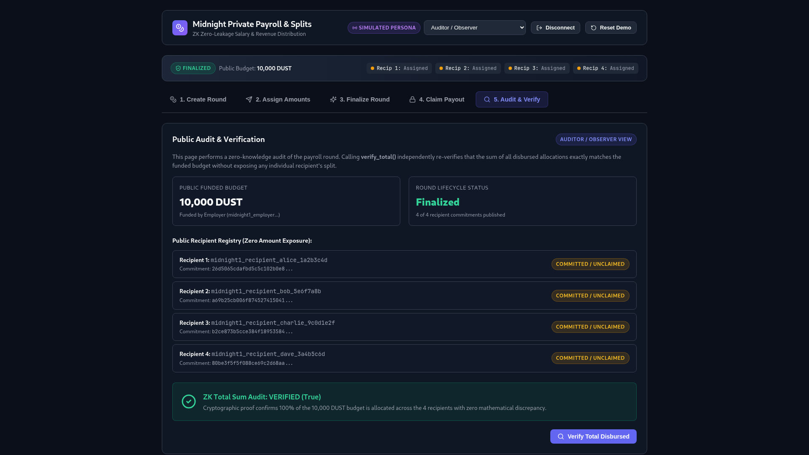
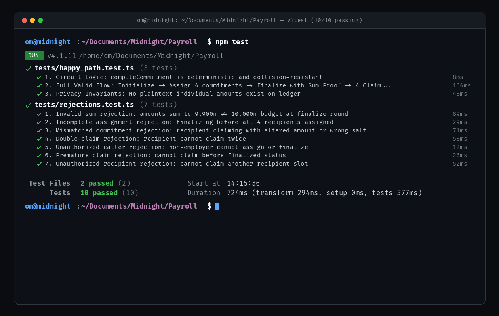

# Private Payroll / Splits System

[](https://github.com/d35r0n/private-payroll/actions/workflows/ci.yml)
[](https://midnight.network)
[](LICENSE)

A privacy-preserving payroll and revenue-splits dApp built on the **Midnight Network** using **Compact 0.23**. An employer funds a fixed public budget and distributes it across N recipients (N = 4 for demo), with each recipient's individual compensation kept strictly private — while anyone can mathematically verify that the total disbursed exactly equals the funded budget with zero discrepancy.

---

## Overview

### Problem
On traditional transparent blockchains, all transaction amounts, salaries, and token disbursements are permanently visible to the public. For enterprise payroll, contractor payouts, executive compensation, grant disbursements, and confidential revenue splits, publishing individual compensation amounts introduces severe competitive, privacy, and social friction.

### Solution
Using Midnight's Zero-Knowledge Compact smart contracts, the employer generates cryptographic commitments for each recipient's allocation client-side. During the finalization phase, the employer submits a ZK proof (`prove_total`) demonstrating that the hidden allocations match the on-chain commitments and sum exactly to the public budget. Observers learn that the disbursement is 100% solvent and compliant without learning any individual salary.

### Why Midnight?
Midnight natively enables dual-state architecture: combining public ledger state (for verifiable budgets and audit checks) with private witness states (for sensitive amounts and salts).

---

## Live Demo & Video

- **Live Demo:** [https://private-payroll-demo.midnight.network](https://private-payroll-demo.midnight.network) *(Placeholder)*
- **Demo Video (1 min):** [Watch Demo Video (Google Drive)](https://drive.google.com/file/d/1QH_Xfdgcq3w9qwENj-oKa1MukIJiYFiq/view?usp=sharing) 

---

## How It Works

```
 ┌─────────────────┐       ┌─────────────────┐       ┌─────────────────┐
 │ 1. Create Round │ ────> │ 2. Assign (ZK)  │ ────> │ 3. Finalize Sum │
 │ Budget + 4 Addr │       │ hash(amt, salt) │       │ prove_total ZK  │
 └─────────────────┘       └─────────────────┘       └─────────────────┘
                                                               │
                                                               ▼
 ┌─────────────────┐                                 ┌─────────────────┐
 │ 5. Public Audit │ <────────────────────────────── │ 4. Recipient    │
 │ verify_total()  │   Read-only Solvency Check      │    Claim Amount │
 └─────────────────┘                                 └─────────────────┘
```

1. **Create Round:** Employer deploys/initializes a payout round with a public `budget` and 4 recipient addresses.
2. **Assign Amounts:** Employer assigns private amounts, generates cryptographic salts client-side, computes `commitment = hash(amount, salt)`, and publishes commitments to the ledger.
3. **Finalize Round (Sum Proof):** Employer runs `prove_total` circuit. The ZK circuit verifies that all 4 commitments are authentic, amounts are non-negative, and `sum(amounts) == budget`. Status transitions to `Finalized`.
4. **Claim Amount:** Each recipient submits their private `(amount, salt)` to `claim_amount`. The contract verifies the commitment match and sets `claimed = true` without ever revealing the amount.
5. **Public Audit:** Any observer or regulator calls `verify_total()` to verify complete disbursement solvency.

---

## Privacy Model

### What an observer CAN learn:
- That a payout round exists, its public funded budget, and the list of 4 recipient addresses.
- That the round has been finalized.
- That the sum of all distributed amounts provably equals the public budget (`sum of all 4 amounts == budget`).
- Which recipients have claimed their payout (a public boolean flag `claimed: true/false`, not an amount).

### What an observer CANNOT learn:
- Any individual recipient's amount.
- Relative comparisons between recipients (who got more/less than whom).
- The employer's allocation logic or reasoning.

---

## Screenshots & dApp Walkthrough

### 1. Create Payout Round (Employer)
The employer initializes a payout round by specifying a public total budget (e.g. 10,000 tDUST) and registering 4 recipient addresses.


### 2. Private Allocations & Client-Side Salt Hashing
The employer assigns individual amounts client-side. Cryptographic salts blind each allocation, generating public commitment hashes while maintaining a private running total for self-check.


### 3. Finalize Round with ZK Sum-Proof (`prove_total`)
The employer submits the `prove_total` ZK proof, mathematically verifying that the hidden allocations match the stored commitments and sum exactly to the 10,000 tDUST budget without exposing any individual salary.


### 4. Recipient Private Claim Portal
Recipients authenticate their claim in zero knowledge with their private witness key (`amount` and `salt`). The payout amount is shown only to the recipient locally, while on-chain observers only see a boolean flag `claimed: true`.


### 5. Public Solvency Audit Dashboard (`verify_total`)
Auditors, regulators, or observers can invoke the `verify_total()` read-only view circuit to cryptographically verify 100% solvency and budget compliance without access to private employee data.


---

## Architecture

- **`contracts/circuits/`**:
  - `assign_amount.compact`: Computes public commitment from private `(amount, salt)`.
  - `prove_total.compact`: ZK circuit enforcing commitment integrity and `sum(amounts) == budget`.
  - `claim_amount.compact`: Authenticates recipient claim knowledge against stored commitment.
  - `verify_total.compact`: View circuit confirming valid finalization.
- **`contracts/payroll_contract.compact`**: Full on-chain contract state and entry points (`create_round`, `assign_amount`, `finalize_round`, `claim_amount`, `verify_total`).
- **`contracts/src/witnesses.ts`**: TypeScript witness providers for supplying private witness inputs to circuits.
- **`frontend/`**: Modern React 19 + TypeScript + Vite dApp featuring employer workflows, recipient claim portal, live wallet switching, and public audit dashboard.

---

## Tests

The project includes an automated test suite verifying both happy path flows and comprehensive rejection cases (**10/10 tests passing**):

```bash
npm test
```



### Test Coverage Highlights:
- **`tests/happy_path.test.ts`**:
  - Deterministic & collision-resistant commitment hashing.
  - Complete 5-step lifecycle: Init -> Assign -> Finalize -> Claim -> Audit.
  - Strict privacy assertion: Zero individual amounts stored on public ledger.
- **`tests/rejections.test.ts`**:
  - Rejection of invalid sums (`sum != budget`).
  - Rejection of incomplete assignments prior to finalization.
  - Rejection of mismatched commitments / tampered amounts / incorrect salts.
  - Prevention of double-claim attempts.
  - Unauthorized caller access control checks on employer and recipient entry points.
  - Prevention of premature claims before finalization.

---

## Deployment

- **Network:** Midnight Testnet (Preprod)
- **Contract Address:** [`3618f459d6e65a10b4a410d514f43d386197df363d9e378c1016df2e4995f075`](https://explorer.1am.xyz/contract/3618f459d6e65a10b4a410d514f43d386197df363d9e378c1016df2e4995f075?network=preprod)
- **Deployment Transaction:** [`c0446bedf8d14e6885b7412a1d211e0f4363f510aef36cb13f6c9e4fce1f31e1`](https://explorer.1am.xyz/tx/c0446bedf8d14e6885b7412a1d211e0f4363f510aef36cb13f6c9e4fce1f31e1?network=preprod)

---

## Running Locally

### Prerequisites
- Node.js 20+
- Midnight Compact Compiler (`compact 0.5.2+`)

### Setup & Execution
```bash
# 1. Install dependencies across monorepo
npm install

# 2. Compile Compact smart contracts and generate ZK proving keys
npm run compile

# 3. Build contract artifacts
npm run build

# 4. Run automated test suite
npm test

# 5. Launch frontend dApp
npm run dev
```

---

## Product Proposal

- **Target Use Cases:** Enterprise Payroll, DAO Contributor Splits, Freelancer Escrow & Milestone Payouts, Confidential Grants, Royalty & Revenue Sharing.
- **Key Advantage:** Eliminates the transparency paradox of blockchain payroll by replacing transparent balances with mathematically verifiable ZK sum proofs.
